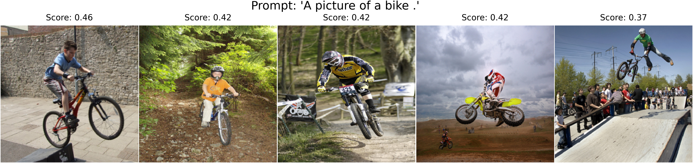
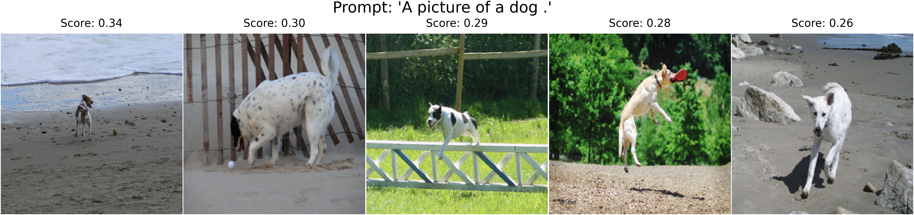
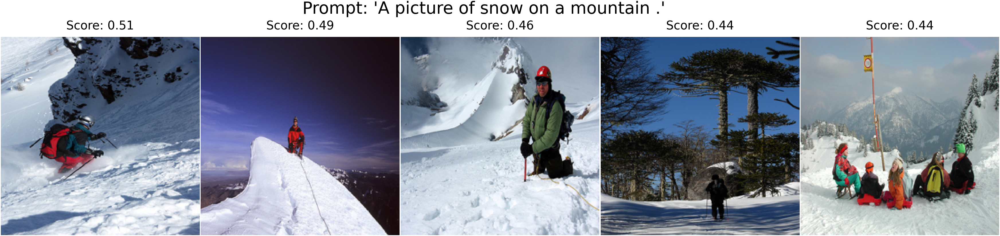
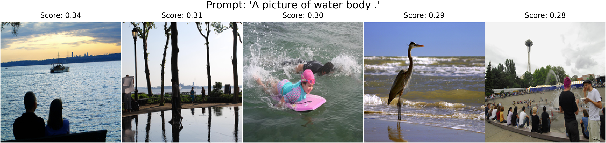
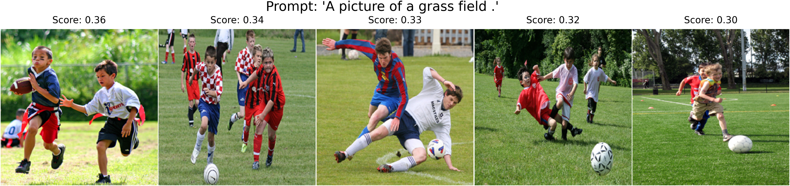

# CLIP from scratch
Implementing from scratch the paper ["Learning Transferable Visual Models From Natural Language Supervision"](https://arxiv.org/abs/2103.00020) ICML 2021 (OpenAI CLIP).

### Clone and install dependencies
``` 
git clone https://github.com/aldipiroli/clip_from_scratch
pip install -r requirements.txt && cd clip
``` 
### Train 
``` 
python train.py config/clip_config.yaml
```

### Inference: text-to-image querying
``` 
python inference.py --config config/clip_config.yaml --ckpt path/to/ckpt --prompt "A picture of a dog ."
```

### Examples
> Prompt and k-nearest scores (using cosine similarity between text and image embeddings)





